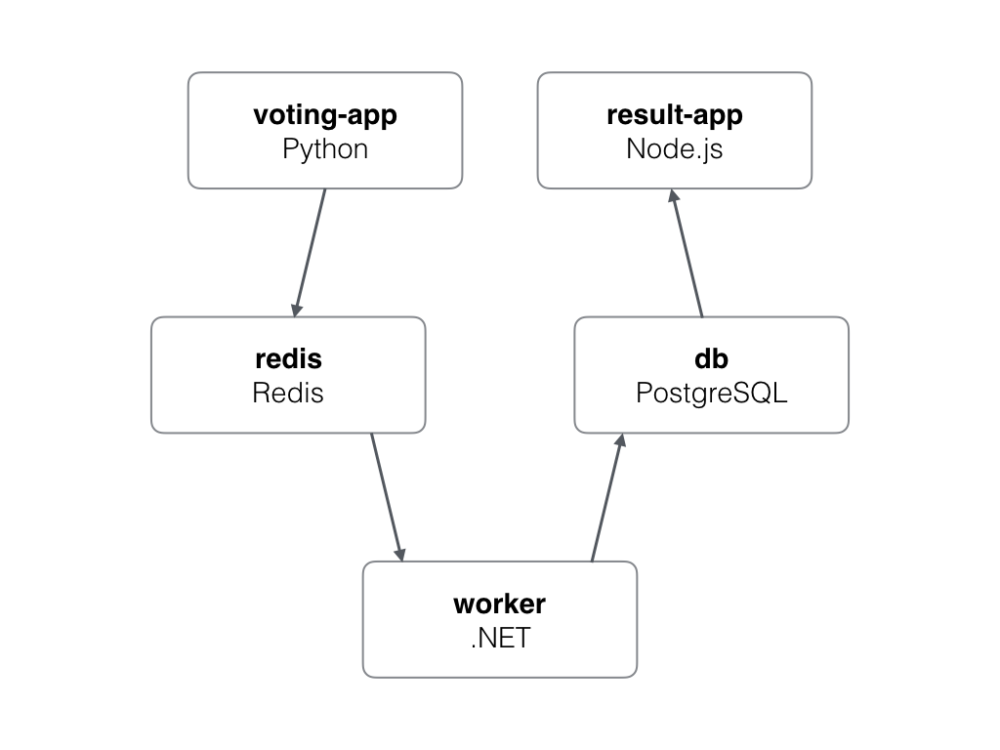

# Voting Demo App

## Usage
Run `docker-compose up` or `kubectl apply -f kubernetes.yaml` depending on where you want to let it run.

**Important**: Replace the two `YOUR-PUBLIC-IP-HERE` placeholders inside `kubernetes.yaml` before you run `kubectl apply`. Use `curl ifconfig.me` to find our own public IP.
If you need a small single-node K8s demo cluster, you may also be interested in [this guide here](https://gist.github.com/PhilipSchmid/57ce0801fbe7b68f70b9b58e1e3225b3).

## Architecture

## Credit
Application source code taken from https://github.com/dockersamples/example-voting-app.
